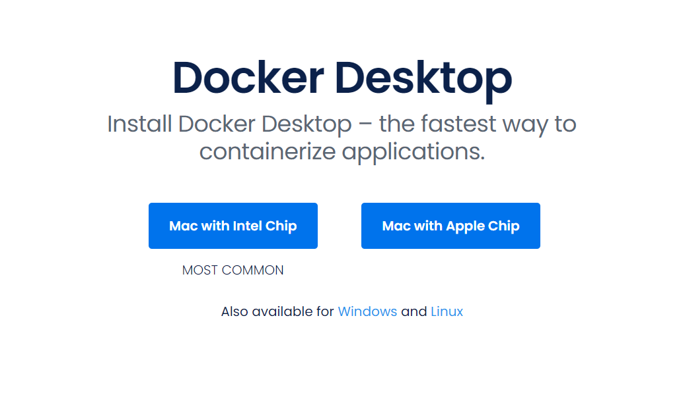
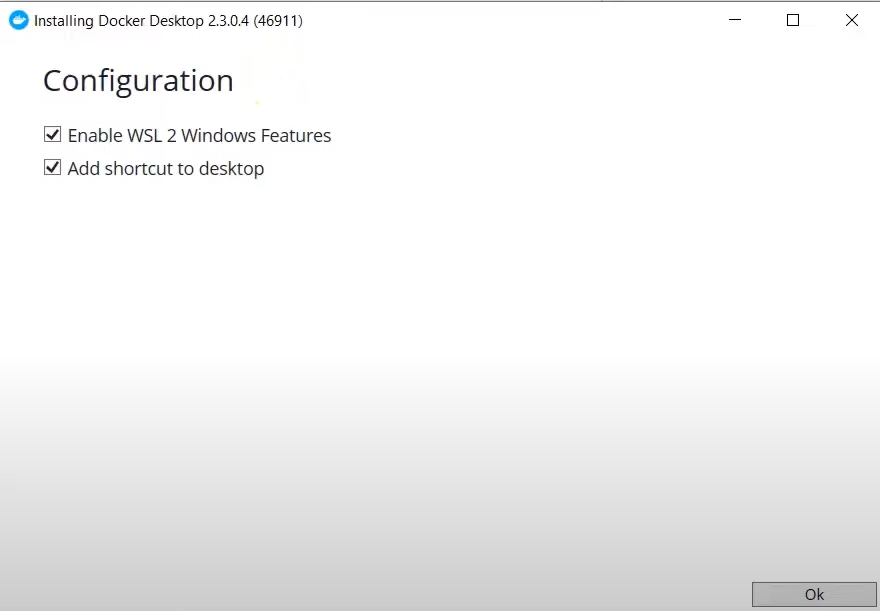
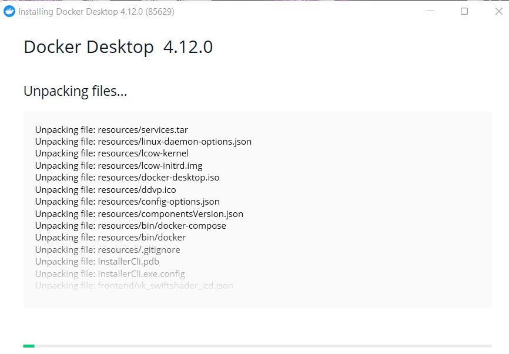
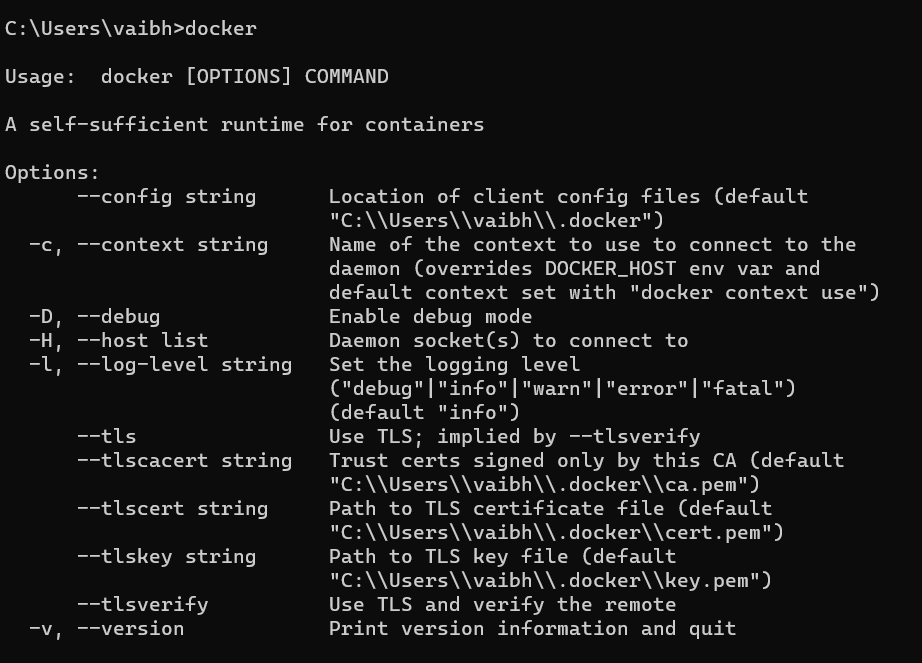

## Docker là gì & Cài đặt

Trong bài viết trước, tôi đã đề cập đến Docker ít nhất một lần và lý do là Docker đá đóng góp công lớn trong việc làm cho container trở nên phổ biến mặc dù chúng đã xuất hiện từ lâu.

Chúng ta sẽ sử dụng và giải thích về docker nhưng cũng sẽ đề cập tới [Open Container Initiative (OCI)](https://www.opencontainers.org/) là một tổ chức tiêu chuẩn công nghiệp khuyến khích đổi mới đồng thời giảm thiểu nguy cơ các dịch vụ bị khoá với các nhà cung cấp. Nhờ có OCI, khi chúng ta chọn chuỗi các công cụ container, chúng ta có thể chọn Docker, [CRI-O](https://cri-o.io/), [Podman](http://podman.io/), [LXC](https://linuxcontainers.org/), và các công cụ khác.

Docker là một khung phần mềm để xây dựng, chạy, quản lý các vùng chứa. Thuật ngữ "docker" có thể đề cập đến các công cụ (các lệnh và deamon)
 hoặc định dạng tệp Dockerfile. 

Chúng ta sẽ sử dọng Docker Personal trong tuần này, nó sẽ được miễn phí cho mục đích học tập. Tất cả những chức năng cần thiết mà chúng ta cần trang bị để có kiến thức nền tảng tốt về container và công cụ xung quanh đều có trong Docker Personal.

Có lẽ đáng để chia nhỏ một số công cụ "docker" mà chúng ta sẽ sử dụng và cách chúng được sử dụng. Thuật ngữ docker có thể đề cập đến dự án docker nói chung, đây là một nền tảng dành cho các nhà phát triển và quản trị viên để phát triển, vận chuyển và chạy các ứng dụng. Nó cũng có thể nhắn tới process docker daemon chạy trên máy chủ quản lý image và container, hay còn được gọi là Docker Engine.

### Docker Engine

Docker Engine là một công nghệ container mã nguồn mở để xây dựng và đóng gói các ứng dụng của bạn. Docker Engine hoạt động như một ứng dụng client-server với:

- Một máy chủ có tiến trình daemon dockerd.
- API với các giao diện mà các chương trình có thể sử dụng để giao tiếp và đưa ra chỉ thị với daemon Docker.
- Giao diện dòng lệnh (CLI) của docker.

Phần trên được lấy từ tài liệu chính thức của Docker và [Tổng quan về Docker Engine cụ thể](https://docs.docker.com/engine/)

### Docker Desktop

Chúng ta có docker desktop cho cả Windows và macOS. Nó là một môi trường phát triển docker nhẹ, dễ cài đặt. Một ứng dụng native với khả năng tận dụng khả năng ảo hóa trên hệ điều hành máy chủ.

Đây là giải pháp tốt nhất nếu bạn muốn xây dựng, gỡ lỗi, thử nghiệm, đóng gói và vận chuyển các ứng dụng Dockerized trên Windows hoặc macOS.

Trên Windows, chúng ta cũng có thể tận dụng WSL2 và Microsoft Hyper-V. Chúng ta sẽ đề cập đến một số lợi ích của WSL2 trong các phần tiếp theo.

Do tích hợp với các khả năng của trình ảo hóa trên hệ điều hành máy chủ, docker cung cấp khả năng chạy các vùng chứa của bạn với Hệ điều hành Linux.

### Docker Compose

Docker compose là một công cụ cho phép bạn chạy các ứng dụng phức tạp hơn trên nhiều containers. Với lợi ích là có thể sử dụng một tệp và lệnh duy nhất để khởi động ứng dụng của bạn.

### Docker Hub

Một tài nguyên tập trung để làm việc với Docker và các thành phần của nó. Thường được gọi là một registry để lưu trữ các docker images. Nhưng có rất nhiều dịch vụ bổ sung ở đây có thể được sử dụng để tự động hóa, tích hợp vào GitHub hoặc quét bảo mật.

### Dockerfile

Dockerfile là một tệp văn bản chứa các lệnh mà bạn thường thực hiện thủ công để tạo docker image. Docker có thể tự động tạo image bằng cách đọc các chỉ dẫn chúng ta có trong dockerfile của mình.

## Cài đặt Docker Desktop

[Tài liệu của Docker](https://docs.docker.com/engine/install/) rất tốt cho các bạn mới tìm hiểu về docker. Chúng ta sẽ sử dụng Docker Desktop trên Windows với WSL2. Tôi đã cài đặt cho máy tính mà chúng ta sẽ sử dụng ở trong phần này.

Lưu ý trước khi bạn tiếp tục và 

Take note before you go ahead and install at the system requirements, [Install Docker Desktop on Windows](https://docs.docker.com/desktop/windows/install/) if you are using macOS including the M1-based CPU architecture you can also take a look at [Install Docker Desktop on macOS](https://docs.docker.com/desktop/mac/install/)

Tôi sẽ cặt đặt Docker Desktop cho Windows trên một máy Windows khác và ghi lại quá trình bên dưới.

### Windows

- Chọn windows làm hệ điều hành cho thiết bị của bạn.

- Điều hướng đến thư mục mà bạn muốn lưu bộ cài đặt và lưu lại.

- Chạy bộ cài và đợi vài giây rồi cấp quyền truy cập cho WSL.

- Nhấn ok và quá trình cài đặt sẽ bắt đầu.

- Docker Desktop đã được cài đặt thành công trên thiết bị của bạn. Bây giờ bạn có thể chạy lệnh "docker" trên terminal để kiểm tra xem cài đặt có thành công hay không.

## Tài liệu tham khảo

- [TechWorld with Nana - Docker Tutorial for Beginners](https://www.youtube.com/watch?v=3c-iBn73dDE)
- [Programming with Mosh - Docker Tutorial for Beginners](https://www.youtube.com/watch?v=pTFZFxd4hOI)
- [Docker Tutorial for Beginners - What is Docker? Introduction to Containers](https://www.youtube.com/watch?v=17Bl31rlnRM&list=WL&index=128&t=61s)
- [WSL 2 with Docker getting started](https://www.youtube.com/watch?v=5RQbdMn04Oc)

Hẹn gặp lại vào [ngày 44](day44.md)
