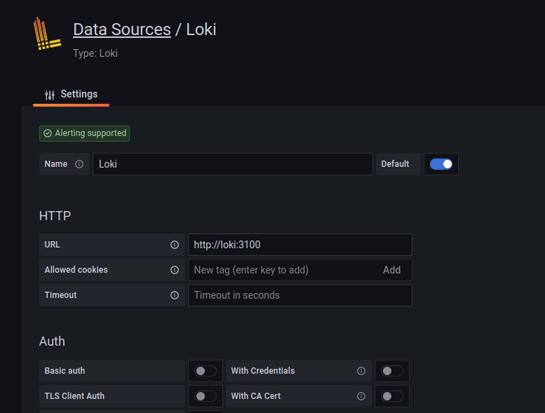
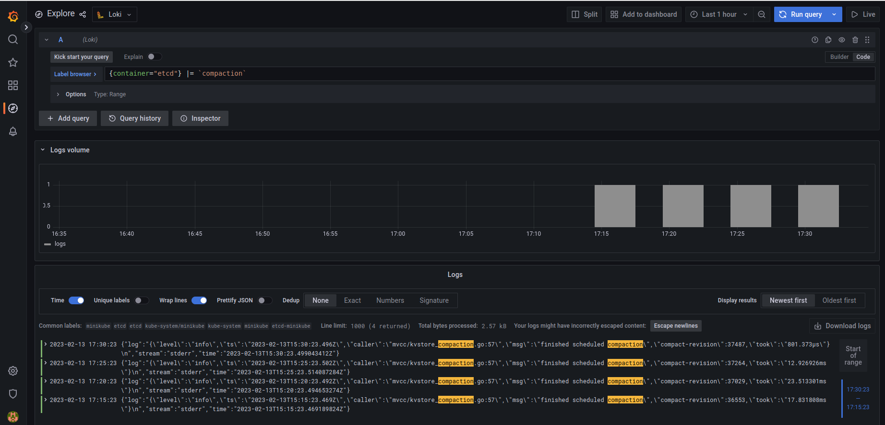

# Recap

Last day we discussed why monitoring, logging and auditing are the basics of runtime defense. In short: you cannot protect a live system without knowing what is happening. We built a Minikube cluster yesterday with Prometheus and Grafana. We are continuing to build over this stack today.
Let's start 😎

# Application logging

Application logs are important from many perspective. This is the way operators know what is happening inside applications they run on their infrastrucutre. For the same reason, keeping application logs is important from a security perspective because they provide a detailed record of the system's activity, which can be used to detect and investigate security incidents.

By analyzing application logs, security teams can identify unusual or suspicious activity, such as failed login attempts, access attempts to sensitive data, or other potentially malicious actions. Logs can also help track down the source of security breaches, including when and how an attacker gained access to the system, and what actions they took once inside.

In addition, application logs can help with compliance requirements, such as those related to data protection and privacy. By keeping detailed logs, organizations can demonstrate that they are taking the necessary steps to protect sensitive data and comply with regulations.

Loki is a component in the Grafana stack which collects logs using Promtail for Pods running in the Kubernetes cluster and stores them just as Prometheus does for metrics.

To install Loki with Promtail on your cluster, install the following Helm chart.

```bash
helm install loki --namespace=monitoring grafana/loki-stack
```

This will put a Promtail and a Loki instance in your Minikube and will start collecting logs. Note that this installation in not production grade and it is here to demonstrate the capabilities.

You should be seeing the Pods are ready: 
```bash
$ kubectl get pods | grep loki
loki-0                                               1/1     Running       0             8m25s
loki-promtail-mpwgq                                  1/1     Running       0             8m25s
```

Now go to your Grafana UI (just as we did yesterday):

```bash
kubectl get secret --namespace default grafana -o jsonpath="{.data.admin-password}" | base64 --decode ; echo
minikube service grafana-np --url
```

Take the secret of the admin password (if you haven't changed it already) and print the URL of the service, then go to the URL and log in.

In order to see the logs in Grafana, we need to hook up Loki as a "data source" just as we did yesterday with Prometheus. 


Now add here a new Loki data source.

The only thing that needs to be changed in the default configuration is the endpoint of the Loki service, in our case it is http://loki:3100, see it below:



Now click "Save & test" and your Grafana should be now connected to Loki.

You can explore your logs in the "Explore" screen (click Explore in the left menu).

To try our centralized logging system, we are going to check when Etcd container did compactization in the last hour.

Choose Loki source on the top of the screen (left of the explore title) and switch from query builder mode (visual builder) to code.

Add the following line in the query field:
```
{container="etcd"} |= `compaction`
```
and click "run query" on the top right part of the screen.

You should see logs in your browser, like this:




Voila! You have a logging system ;-)


# Application behavior monitoring

We start to come over from general monitoring needs to low-level application monitoring for security purposes. A modern way to do this is to monitor fine-grade application behavior using eBPF.

Monitoring applications with eBPF (extended Berkeley Packet Filter) is important from a security perspective because it provides a powerful and flexible way to monitor and analyze the behavior of applications and the underlying system. Here are some reasons why eBPF is important for application monitoring and security:

1. Fine-grained monitoring: eBPF allows for fine-grained monitoring of system and application activity, including network traffic, system calls, and other events. This allows you to identify and analyze security threats and potential vulnerabilities in real-time.

2. Relatively low overhead: eBPF has very low overhead, making it ideal for use in production environments. It can be used to monitor and analyze system and application behavior without impacting performance or reliability at scale.

3. Customizable analysis: eBPF allows you to create custom analysis and monitoring tools that are tailored to the specific needs of your application and environment. This allows you to identify and analyze security threats and potential vulnerabilities in a way that is tailored to your unique needs.

4. Real-time analysis: eBPF provides real-time analysis and monitoring, allowing you to detect and respond to security threats and potential vulnerabilities as they occur. This helps you to minimize the impact of security incidents and prevent data loss or other negative outcomes.

Falco is a well-respected project which installs agents on your Kubernetes nodes and monitors applications at the eBPF level. 

In this part, we will install Falco in our Minikube and channel the data it collects to Prometheus (and eventually, Grafana). This part is based on this great [tutorial](https://falco.org/blog/falco-kind-prometheus-grafana/).

In order to install Falco, you need to create private keys and certificates for client-server communication between the Falco and its exporter.

We will use `falcoctl` for this, however you could generate your certificates and keys with `openssl` if you want.

To install `falcoctl`, run the following command (if you are running Linux on amd64 CPU, otherwise check out [here](https://github.com/falcosecurity/falcoctl#installation)):
```bash
LATEST=$(curl -sI https://github.com/falcosecurity/falcoctl/releases/latest | awk '/location: /{gsub("\r","",$2);split($2,v,"/");print substr(v[8],2)}')
curl --fail -LS "https://github.com/falcosecurity/falcoctl/releases/download/v${LATEST}/falcoctl_${LATEST}_linux_amd64.tar.gz" | tar -xz
sudo install -o root -g root -m 0755 falcoctl /usr/local/bin/falcoctl
```

Now generate key pair:
```bash
FALCOCTL_NAME=falco-grpc.default.svc.cluster.local FALCOCTL_PATH=$PWD falcoctl tls install
```

We need to add Falco Helm repo and install the Falco services and the exporter:
```bash
helm repo add falcosecurity https://falcosecurity.github.io/charts
helm repo update
helm install falco falcosecurity/falco --set driver.kind=ebpf --set-file certs.server.key=$PWD/server.key,certs.server.crt=$PWD/server.crt,certs.ca.crt=$PWD/ca.crt --set falco.grpc.enabled=true,falco.grpcOutput.enabled=true,falco.grpc_output=true
helm install falco-exporter  --set-file certs.ca.crt=$PWD/ca.crt,certs.client.key=$PWD/client.key,certs.client.crt=$PWD/client.crt falcosecurity/falco-exporter
```

Make sure that all Falco Pods are running OK
```bash
$ kubectl get pods  | grep falco
falco-exporter-mlc5h                                 1/1     Running       3 (32m ago)   38m
falco-mlvc4                                          2/2     Running       0             31m
```

Since Prometheus detects the exporter automatically and we already added the Prometheus data source, we can go directly to Grafana and install the [Falco dashboard](https://grafana.com/grafana/dashboards/11914-falco-dashboard/).

Go to "Dashboard" left side menu and click import. In "Import via grfana.com" insert the ID `11914` and click "load".

Now you should see Falco events in your Grafana! 😎

# Next... 

Next day we will look into how to detect attacks in runtime. See you tomorrow 😃


