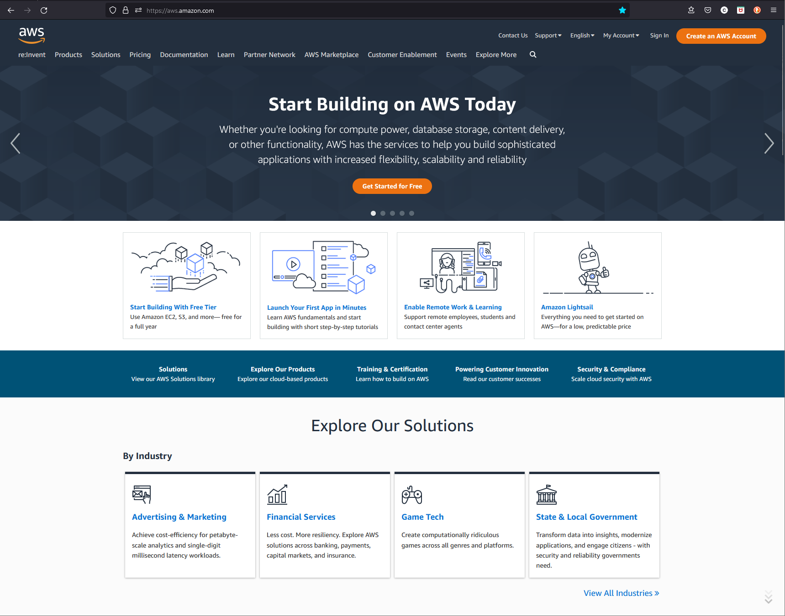
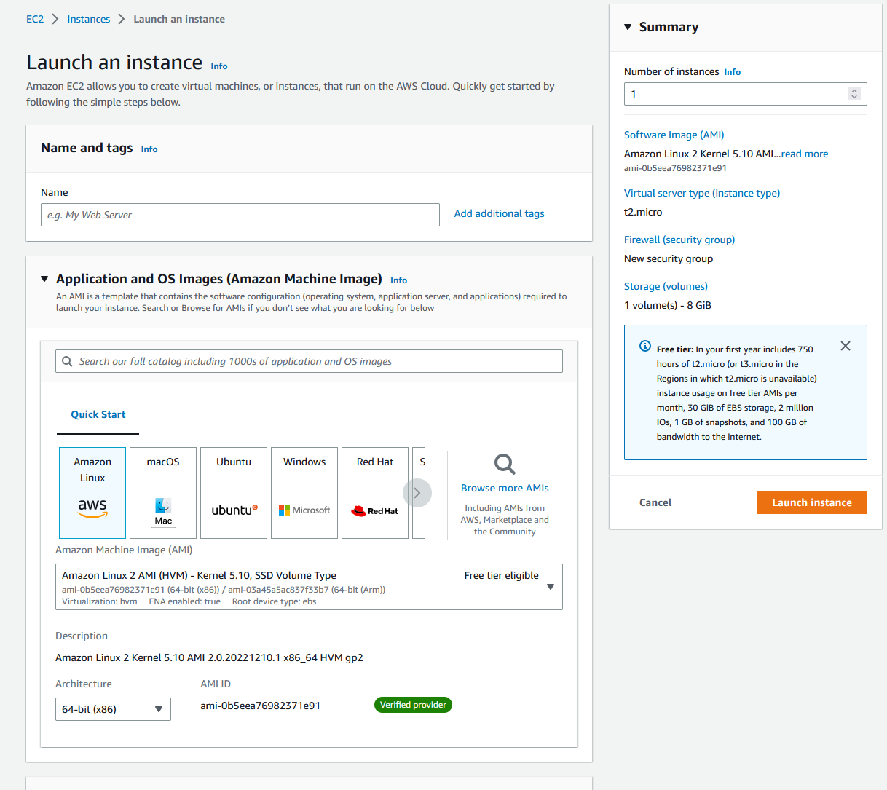
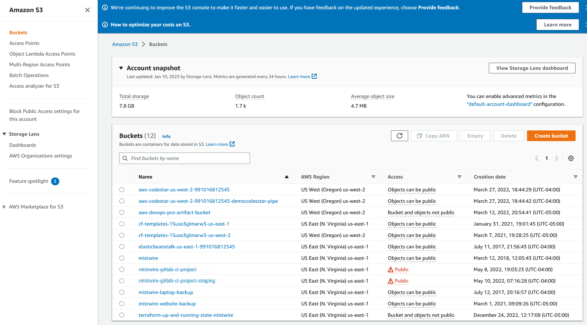
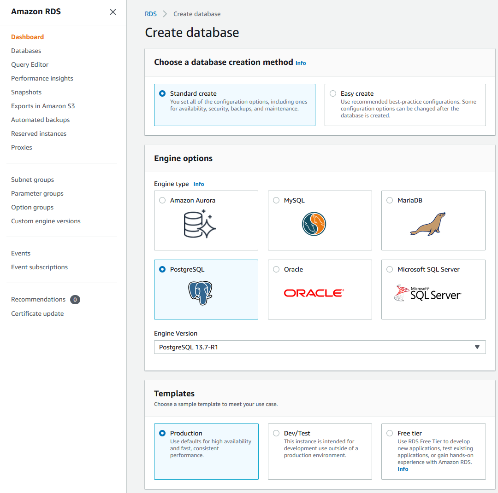

# Day 49: AWS Cloud Overview

AWS Cloud is a cloud computing platform provided by Amazon Web Services (AWS). It offers a wide range of services, including computing, storage, networking, database, analytics, machine learning, security, and more. AWS Cloud allows businesses and organizations to access these services on a pay-as-you-go basis, which means they only pay for what they use and can scale their resources up or down as needed.

## Flexibility

One of the main benefits of AWS Cloud is its flexibility. You can choose the services that best meet your needs and only pay for what you use. This makes it an ideal solution for small businesses, startups, and enterprises, as it allows them to access the resources they need without having to make a significant upfront investment in infrastructure.

## Security 

Another benefit of AWS Cloud is its security. AWS has a number of security measures in place to protect your data and resources, including encryption, identity and access management, and network security. It also has a number of compliance programs in place, including HIPAA, PCI DSS, and GDPR, to ensure that your data is secure and compliant with relevant regulations.

AWS Cloud also offers a range of tools and services to help you manage your resources and infrastructure. For example, the AWS Management Console allows you to monitor and control your resources from a single, centralized dashboard. The AWS Command Line Interface (CLI) allows you to manage your resources from the command line, making it easier to automate tasks and integrate with other tools.

## EC2

One of the most popular services offered by AWS Cloud is Amazon Elastic Compute Cloud (EC2). EC2 allows you to easily launch and manage virtual servers in the cloud, making it easy to scale your resources up or down as needed. You can choose from a range of instance types and sizes, and you only pay for the resources you use.

## S3 

Another popular service offered by AWS Cloud is Amazon Simple Storage Service (S3). S3 is an object storage service that allows you to store and retrieve large amounts of data from anywhere on the internet. It is highly scalable, durable, and secure, making it an ideal solution for storing and managing data in the cloud.

## Databases 

AWS Cloud also offers a range of other services, including Amazon Relational Database Service (RDS) for managing databases, Amazon Redshift for data warehousing and analytics, and Amazon Elasticsearch Service for search and analytics. These services make it easy to build and manage complex applications in the cloud, without having to worry about infrastructure or scaling.

Overall, AWS Cloud is a powerful and flexible cloud computing platform that offers a wide range of services and tools for businesses and organizations of all sizes. Whether you are a small business, startup, or enterprise, AWS Cloud has something to offer you. With its pay-as-you-go pricing, security, and management tools, it is an ideal solution for anyone looking to take advantage of the benefits of cloud computing.

## Resources

