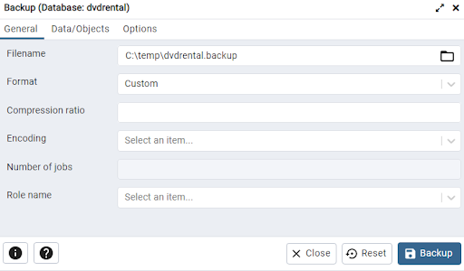
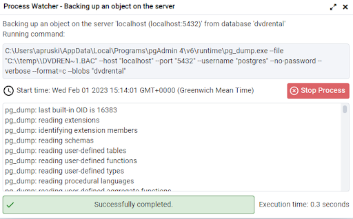
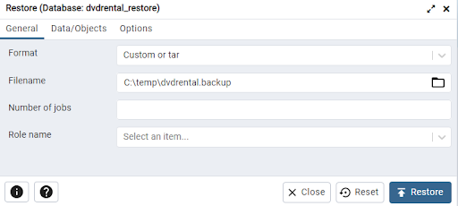
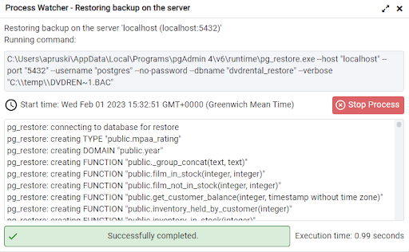
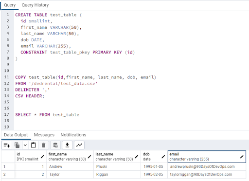
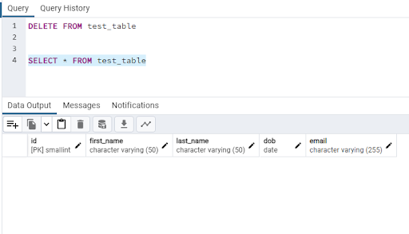
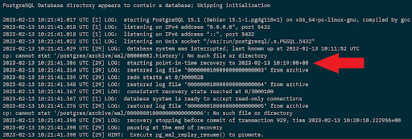
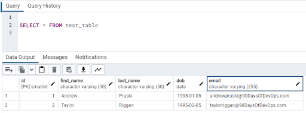

# Backing up and restoring databases

Hello and welcome to the third post in the database part of the 90 Days of DevOps blog series! Today we’ll be talking about backing up and restoring databases.

One of the (if not the) most vital tasks a Database Administrator performs is backing up databases.

Things do go wrong with computer systems not to mention with the people who operate them 🙂 and when they do, we need to be able to recover the data.

This is where backups come in. There are different types of backups, and different types of databases perform their backups in different ways…but the core concepts are the same.

The core backup is the full backup. This is a backup of the entire database, everything, at a certain point in time. These backups are the starting point of a recovery process.

Then there are incremental/differential backups. Certain databases allow for this type of backup to be taken which only includes the data changes since the last full backup. This type of backup is useful when dealing with large databases and taking a full backup is a long process. In the recovery process, the full backup is restored first and then the applicable incremental/differential backup.

Another important type of backup is backing up the “log”. Databases have a log of transactions that are executed against the data stored. Typically the log is written to before any data changes are made so that in the event of a failure, the log can be “replayed” (aka rolling forward any committed transactions in the log, and rolling back any uncommitted transactions) so that the database comes back online in a consistent state.

Log backups allow database administrators to achieve point-in-time recovery. By restoring the full backup, then any incremental/differential backups, and then subsequential log backups, the DBA can roll the database to a certain point in time (say before a data loss event to recover data).

Backups are kept separate from the server that hosts the databases being backed up. You don’t want a server to go down and take its database backups with it! Typically backups will be stored in a centralised location and then shipped to a 3rd site (just in case the whole primary site goes down).

One motto of DBAs is “It’s not a backup process, it’s a recovery process” (or so Andrew says). Meaning that backing up the databases is useless if those backups cannot be restored easily. So DBAs will have a whole host of scripts ready to go if a database needs to be restored to make the process as painless as possible. You really don’t want to be scrabbling around looking for your backups when you need to perform a restore!

Let’s have a look at backing up and restoring a database in PostgreSQL.

 

# Setup

For the demos in this blog post we’ll be using the dvdrental database in the custom PostgreSQL docker image. To spin this image up, start docker, open a terminal, and run: -

    docker run -d \
    --publish 5432:5432 \
    --env POSTGRES_PASSWORD=Testing1122 \
    --name demo-container \
    ghcr.io/dbafromthecold/demo-postgres:latest

Note - the image size is 497MB which may or may not be an issue depending on your internet connection

 

# Taking a full backup

Starting with the simplest of the backup types, the full backup. This is a copy (or dump) of the database into a separate file that can be used to roll the database back to the point that the backup was taken.

Let’s run through taking a backup of the *dvdrental* database in the PostgreSQL image.

Connect into the server via pgAdmin (server name is *localhost* and the password is *Testing1122*), right-click on the *dvdrental* database and select *Backup*…

Enter a directory and filename on your local machine to store the backup file (in this example, I’m using *C:\temp\dvdrental.backup*).

Then hit Backup! Nice and simple!

If we click on the Processes tab in pgAdmin, we can see the completed backup. What’s nice about this is that if we click on the file icon, it will give us a dialog box of the exact command executed, and a step-by-step log of the process run.

The process used a program called pg_dump (https://www.postgresql.org/docs/current/backup-dump.html) to execute the backup and store the files in the location specified.

This is essentially an export of the database as it was when the backup was taken.

 

# Restoring the full backup

Ok, say that database got accidentally dropped (it happens!)…we can use the backup to restore it.

Open a query against the PostgreSQL database and run: -

    DROP DATABASE dvdrental

Note - if that throws an error, run this beforehand: -

    SELECT pg_terminate_backend(pg_stat_activity.pid)
    FROM pg_stat_activity
    WHERE pg_stat_activity.datname = 'dvdrental'
      AND pid <> pg_backend_pid();

OK, now we need to get the database back. So create a new database: -

    CREATE DATABASE dvdrental_restore

Execute that command and then right-click on the newly created database in the left-hand menu, then select *Restore*…

Select the filename of the backup that we performed earlier, then click Restore.

Let that complete, refresh the database on the left-hand menu…and there we have it! Our database has been restored…all the tables and the data is back as it was when we took the backup!

As with the backup, we can see the exact command used to restore the database. If we click on the processes tab in pgAdmin, and then the file icon next to our restore, we will see: -

Here we can see that a program called pg_restore was used to restore the database from the backup file that we created earlier.

 

# Point in time restores

Now that we’ve run through taking a full backup and then restoring that backup…let’s have a look at performing a point-in-time restore of a database.

Full backups are great to get the data at a certain point…but we can only get the data back to the point when that full backup was taken. Typically full backups are run once daily (at the most) so if we had a data loss event several hours after that backup was taken…we would lose all data changes made since that backup if we just restored the full backup.

In order to recover the database to a point in time after the full backup was taken we need to restore additional backups to “roll” the database forward.

We can do this in PostgreSQL as PostgreSQL maintains a write ahead log (WAL) that records every change (transaction) made to the database. The main purpose of this log is that if the server crashes the database can be brought back to a consistent state by replaying the transactions in the log.

But this also means that we can archive the log (or WAL files) and use them to perform a point in time restore of the database.

Let’s run through setting up write ahead logging and then performing a point in time restore.

First thing to do is run a container with PostgreSQL installed: -

    docker run -d \
    --publish 5432:5432 \
    --env POSTGRES_PASSWORD=Testing1122 \
    --name demo-container \
    ghcr.io/dbafromthecold/demo-postgres:latest

Jump into the container: -

    docker exec -it -u postgres demo-container bash

In this container image there are two locations that we will use for our backups. 
*/postgres/archive/base* for the baseline backup and */Postgres/archive/wal* for the log archive.

Now we’re going to edit the *postgresql.conf* file to enable WAL archiving: -

    vim $PGDATA/postgresql.conf

Drop the following lines into the config file: -

    archive_mode = on
    archive_command = 'cp %p /postgres/archive/wal/%f'

- <b>archive_mode</b> - enables WAL archiving
- <b>archive_command</b> - the command used to archive the WAL files (%p is replaced by the path name of the file to archive, and any %f is replaced by the file name).

Exit the container and restart to enable WAL archiving: -

    docker container restart demo-container

OK, the next thing to do is take a base backup of the database cluster. Here we are using pg_basebackup (https://www.postgresql.org/docs/current/app-pgbasebackup.html) which is different from the command used to take a full backup as it backs up all the files in the database cluster. 

Aka it’s a file system backup of all the files on the server whereas the full backup used pg_dump which is used to backup only one database.

Jump back into the container: -

    docker exec -it -u postgres demo-container bash

And take the backup: -

    pg_basebackup -D  /postgres/archive/base

We will use the files taken in this backup as the starting point of our point in time restore.

To test our point in time restore, connect to the database dvdrental in pgAdmin (server is localhost and password is Testing1122), create a table, and import sample data (csv file is in the container image): -

    CREATE TABLE test_table (
      id smallint,
      first_name VARCHAR(50),
      last_name VARCHAR(50),
      dob DATE,
      email VARCHAR(255),
      CONSTRAINT test_table_pkey PRIMARY KEY (id)
    )
    
    COPY test_table(id,first_name, last_name, dob, email)
    FROM '/dvdrental/test_data.csv'
    DELIMITER ','
    CSV HEADER;

Confirm the data is in the test table: -

    SELECT * FROM test_table

What we’re going to do now is simulate a data loss event. For example, an incorrect DELETE statement executed against a table that removes all the data. 

So wait a few minutes and run (make a note of the time): -

    DELETE FROM test_table

Ok, the data is gone! To confirm: -

    SELECT * FROM test_table

We need to get this data back! So, jump back into the container: -

    docker exec -it -u postgres demo-container bash

The first thing to do in the recovery process is create a recovery file in the location of our base backup: -

    touch /postgres/archive/base/recovery.signal

This file will automatically get deleted when we perform our point in time restore.

Now we need to edit the *postgresql.conf* file to tell PostgreSQL to perform the recovery: -

    vim  $PGDATA/postgresql.conf

Add in the following to the top of the file (you can leave the WAL archiving options there): -

    restore_command = 'cp /postgres/archive/wal/%f %p'
    recovery_target_time = '2023-02-13 10:20:00'
    recovery_target_inclusive = false
    data_directory = '/postgres/archive/base'

- <b>restore_command</b> - this is the command to retrieve the archived WAL files
- <b>recovery_target_time</b> - this is the time that we are recovering to (change for just before you executed the DELETE statement against the table)
- <b>recovery_target_inclusive</b> - this specifies to stop the recovery before the specified recovery time
- <b>data_directory</b> - this is where we point PostgreSQL to the files taken in the base backup

Now we need to tell PostgreSQL to switch to a new WAL file, allowing for the old one to be archived (and used in recovery): -

    psql -c "select pg_switch_wal();"

Almost there! Jump back out of the container and then restart: -

    docker container restart demo-container

If we check the logs of the container, we can see the recovery process: -

    docker container logs demo-container

We can see at the end of the logs that we have one more thing to do, so, one more time, jump back into the container: -

    docker exec -it -u postgres demo-container bash

And resume replay of the WAL files: -

     psql -c "select pg_wal_replay_resume();"

OK, finally to confirm, in pgAdmin, connect to the dvdrental database and run: -

    SELECT * FROM test_table

The data is back! We have successfully performed a point in time restore of our database!

Join us tomorrow where we will be talking about high availability and disaster recovery.

Thanks for reading!
