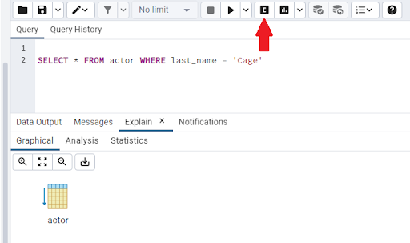
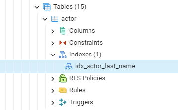
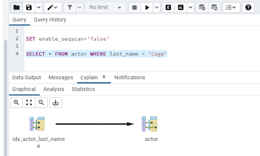
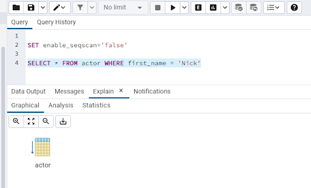
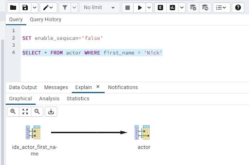

# Performance tuning

Hello and welcome to the fifth post in the database part of the 90 Days of DevOps blog series! Today we’ll be talking about performance tuning.

Performance tuning is a massive area in the database field. There are literally thousands of books, blog posts, videos, and conference talks on the subject. People have made (and are still making) careers out of performance tuning databases.

We’re not going to cover everything here, it’s pretty much impossible to do in one blog post so what we’ll do is talk about the main areas of focus when it comes to ensuring that the database systems we are looking after hits the performance target required.

 

# Server performance tuning

Andrew always tells people to know their environment completely when it comes to approaching performance tuning.

This means we need to start off by looking at the hardware our database is running on.

This used to be “relatively” simple. We had physical servers attached to storage where we would install an OS, and then install our database engine. Here we’re concerned with the specifications of the server, CPU, Memory, and Storage.

<b>CPU</b> - does the server have enough compute power to handle the amount of transactions the database engine will be executing?

<b>Memory</b> - database systems cache data in memory to perform operations (certain ones work entirely in memory - Redis for example). Does the server have enough memory to handle the amount of data that it’ll be working with?

<b>Storage</b> - is the storage available to the server fast enough so that when data is requested from disk it can server up that data with minimal latency?

Nowadays the most common setup for database servers is running on a virtual machine. A physical machine is carved up into virtual machines in order to make resource usage more efficient, improve manageability, and reduce cost.

But this means that we have another layer to consider when looking at getting the maximum performance out of our servers.

Not only do we have the same areas to look at with physical machines (CPU, Memory, Storage) but we also now have to consider the host that the virtual machine is running on.
Does that have enough resources to handle the traffic that the virtual machine will be running? What other virtual machines are on the host that our database server is on? Is the host oversubscribed (i.e. - the virtual machines on the host have more resources assigned to them than the actual physical host has)?

Running database engines in containers is now becoming more popular (as we have been doing in the demos for this series). However just running a database server in one container can lead to issues (see this series’ post on high availability). For production workloads, a container orchestrator is used. There are a few types out there but the main one that has come to the front is Kubernetes.

So this means that we have a whole bunch of other considerations when thinking about performance for our database engine.

What spec are the hosts in the Kubernetes cluster? Will they have enough resources to handle the traffic of our database engine? What else is running on that cluster? Have we got the correct setting in our deployment manifest for our database engine?

Knowing your environment completely is the first step in building a database server that will perform to the required standard. Once we know we have built a server that can handle the transactions hitting our databases we can move onto the next step, tuning the database engine itself.

 

# Database engine performance tuning

Database systems come with a huge variety of different settings that can be used to tune them. Now there are settings that Database Administrators will 100% say that need to be altered for all workloads, no matter what they are, but then there are others that depend on the workload itself.

For example, the memory available to the database engine may not be enough for the workload that the system will be dealing with, in which case it will need to be increased. Or conversely, it may not be limited at all…which would allow the database engine to consume all the memory on the server, starving the OS and leading to issues…so that would need to be limited.

Getting the right configuration settings can be a daunting process…especially anyone new to the particular database system being tuned. This is where development environments come into play…having a development environment that is (somewhat) similar to a production environment allows Database Administrators to make configuration changes and monitor.

Ok, the challenge here is that typically, development environments do not get the throughput that production environments do, and the databases are smaller as well.

To get around this, there are a host of tools out there that can simulate workload activity. A DBA would run a tool to get a baseline of the performance of the system, make some configuration changes, then run the tool again to see what (if any 🙂 ) the increase in performance is.

Once the database engine is configured we can then move onto the next area of performance tuning, query performance.

 

# Query performance tuning

Even with a powerful server and properly configured database engine, query performance can still be poor.

Thankfully there are a host of tools that can capture queries hitting databases and report on their performance. If a particular query starts suffering, a DBA needs to go and analyse what has gone wrong.

When a query hits a database, an execution plan for that query is generated…an execution plan is how the data will be retrieved from the database.

The plan is generated from statistics stored in the database which could potentially be out of date. If they are out of date then the plan generated will result in the query being inefficient.

For example…if a large dataset has been inserted into a table, the statistics for that table may not have been updated, resulting in any queries to that table then having an inefficient plan generated as the database engine does not know about the new data that has been inserted.

Another key factor when it comes to query performance is indexing. If a query hits a large table and does not have a supporting index, it will scan through every row in the table until it finds the row required…not an efficient way to retrieve data.

Indexes solve this problem by pointing the query to the correct row in the table. They are often described as the index of a book. Instead of a reader going through each page in a book to find what they need, they simply go to the index, find the entry in the index that points them to the page in the book they are looking for, and then go straight to that page.

So the key questions a Database Administrator will ask when troubleshooting query performance are…are the statistics up to date? Are there any supporting indexes for this query?

It can be tempting to add indexes to a table to cover all queries hitting it, however when data in a table is updated, any indexes on that table need to be updated as well so there is a performance hit on INSERT/UPDATE/DELETE queries. It’s all about finding the correct balance.

Let’s have a look at indexes in the *dvdrental* database.

Run a container: -

    docker run -d \
    --publish 5432:5432 \
    --env POSTGRES_PASSWORD=Testing1122 \
    --name demo-container \
    ghcr.io/dbafromthecold/demo-postgres:latest

Connect to the dvdrental database in pgAdmin (server is *localhost* and password is *Testing1122*). Open a new query window and run the following: -

    SELECT * FROM actor WHERE last_name = ‘Cage’

We can see that 200 rows are returned. If we want to see the execution plan being used we can hit the Explain button: -

Here we can see that the plan is really simple. We have just one operation, a scan on the actor table.

However, if we look at the actor table in the left hand side menu, there is an index on the last_name column!

So why didn’t the query use that index?

This is due to the size of the table…it only has 200 rows so the database engine decided that a full table scan would be more efficient than doing an index lookup. This is just one of the very many nuances of query performance!

Let’s force PostgreSQL to use that index. Run the following: -

    SET enable_seqscan=’false’

NOTE - this setting is just for developing queries to see if a particular query would use an index on a large dataset. Don’t go doing this in a production environment!

Then highlight the SELECT statement and hit the Explain button: -

And there we can see that the query now is using the index and then going back to the table! So if the dataset here was larger, we know that we have an index to support that query.

Ok, but what about querying on first_name in the actor table: -

    SELECT * FROM actor WHERE first_name = 'Nick'

Here we can see that we’re back to the table scan. There’s no supporting index on the first_name column!

Let’s create one: -

    CREATE INDEX idx_actor_first_name ON public.actor (first_name)

Now explain the SELECT statement on first_name again: -

And there we have it! Our query now has a supporting index!

Join us tommorrow where we'll be talking about database security.

Thanks for reading!
