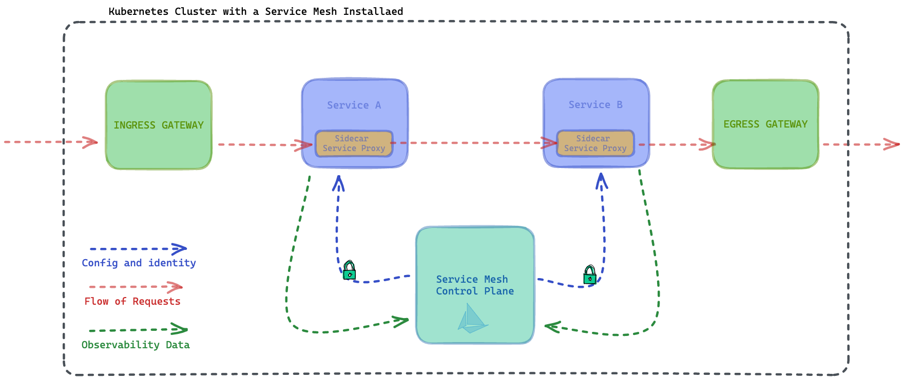

## Day 77 - Let's break down a Service Mesh - #90DaysOfDevOps
> **Informational**
> *An introduction to Service Mesh, the use-cases, and the problems it aims to solve.*
### What is a Service Mesh?
In modern distributed environments, applications are broken up into small chunks of code that run inside of a container. These containers need to be able to communicate with each other, and while they normally can, in a Kubernetes environment, there is a higher order of control, visiblity, and security that's required. Each of these containers, or services interact with other services, but must do so in an encrypted an authorized manner. There are other challenges with having coordinate service to service communication. What happens when one particular service is unavailable to provide a response? How would you troubleshoot this, and fix it so it doesn't happen again? How can we tune our applications to respond in an appropriate amount of time?

These are small subset of challenges when it comes to running and managing applications, or microservices on a network. The unpredictability of the network means we shouldn't rely too much on it being there. We also can't keep changing our code to adapt to changing network conditions, so what do we do?

Enter a Service Mesh. A Service Mesh is an application network layer that handles service-to-service communication, by providing a layer for granular traffic control, AuthN, AuthZ, and observability.

### What are the challenges a Service Mesh aims to solve?m
1. Unreliable and changing networks that are complex, while having to adapt while your microservices scale
2. Ensuring a near zero-trust like environment where,  RBAC, AuthZ and AuthN are critical.
3. Ensuring a data-loss prevention approach using encryption and traffic filtration techniques
4. Determining and visualizing the health of an application and the characteristics of how it handles requests
5. Ensuring availability and reliability of services.

### Key features of a service mesh
Here are key features of a service mesh:
- Load balancing of services
- Service discovery across multiple environments
- Granular traffic control and routing of HTTP and gRPC requests
- Automatic retries of requests
- Fault injection for resiliency
- Logging, monitoring and metrics
- Peer authentication and authorization
- Service-to-service encryption with mTLS

### What does a Service Mesh look like?

A service mesh usually has a few key components:
- A control plane for which to deploy configurations to
- A data plane implemented in both the sidecar and gateways
- The Kubernetes cluster it resides on

To describe how a service mesh behaves, an operator will apply a traffic routing or security policy, and the service mesh control plane will push any configuritions or policy to either the gateways or sidecar proxies. The gateway and sidecars will enforce any traffic rule. In the diagram above, the ingress gateway is the first to receive the external inbound request. It will forward it along to the first service in the request path, service A. Service A has a sidecar to process this request, and send back any telemetry data to the control plane. There's more to this but we'll explore in depth in the following days.

### Relationship to Kubernetes
Kubernetes has some challenges in how it can handle things like multi-cluster and cross-cluster communication, identity stewardship. What a Service Mesh does is it takes on the responsibilities for things like:
- certificate rotation and management
- encryption between services
- granular traffic routing by way of Ingress and service-to-service routing
- visibility and metrics of application health

### Service Mesh Offerings
There are PLENTY of service mesh offerings out there. Some are highly proprietary while others are very open. 
We will cover some options for the next day, *Comparing Different Service Meshes*. Here's a start to get a sense of what Service Mesh solutions are out there.

#### Istio 
Istio is an open-source service mesh built by Google, IBM, and Lyft, and currently actively developed on and maintained by companies such as Solo.io. It is based on the Envoy proxy which is adopted for the sidecar pattern. Istio offers a high degree of customization and extensibility with advanced traffic routing, observability, and security for microservices. A new mode of operation for sidecar-less service mesh, called Ambient Mesh, was launched in 2022.

#### AppMesh
AppMesh is a service mesh implementation that is proprietary to AWS but primarily focuses in on applications deployed to various AWS services such as ECS, EKS, EC2. Its tight-nit integration into the AWS ecosystem allows for quick onboarding of services into the mesh. 

#### Consul 
Consul is a serivce mesh offering from Hashicorp that also provides traffic routing, observability, and sercurity much like Istio does.

#### Linkerd
Linkerd is an open-source service mesh offering that is lightweight. Similar to Istio, it provides traffic management, observability, and security, using a similar architecture. Linkerd adopts a sidecar-pattern using a Rust-based proxy.

#### Cilium
Cilium is a Container Networking Interface that leverages eBPF to optimize packet processing using the Linux kernel. It offers some Service Mesh capabilities, and doesn't use the sidecar model. It proceeds to deploy a per-node instance of Envoy for any sort of Layer 7 processing of requests. 

### Conclusion
A serivce mesh is a power application networking layer that provides traffic management, observability, and security. We will explore more in the next 6 days of #90DayofDevOps!
